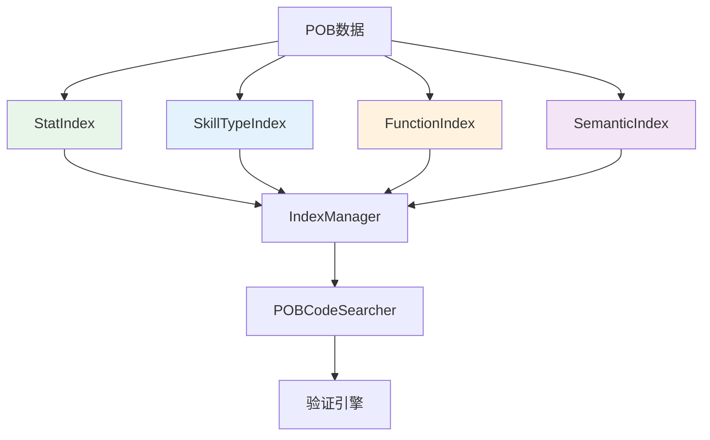
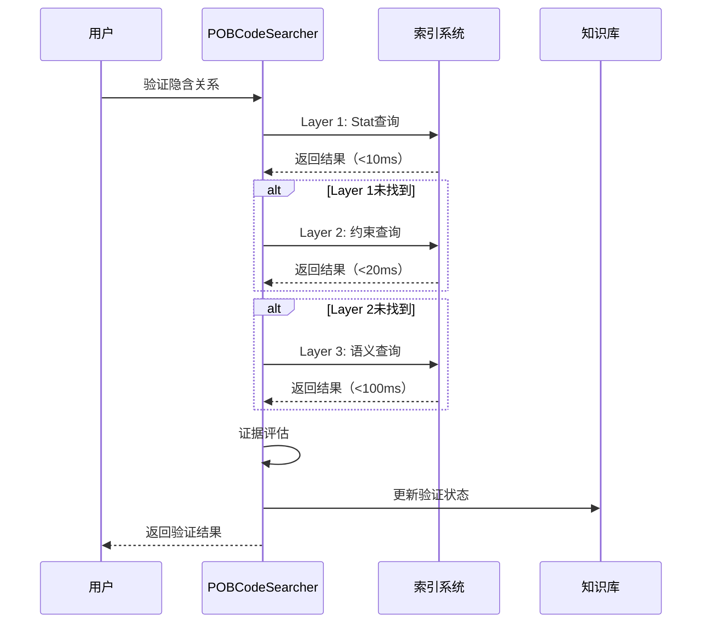

# Phase 0 & Phase 1 完成总结

## 完成时间
2026-03-11

## Phase 0: 索引系统基础 ✅

### 已完成的工作

#### 1. 四级索引系统实现

| 索引类型 | 文件 | 功能 | 性能目标 | 代码行数 |
|---------|------|------|---------|---------|
| **StatIndex** | `stat_index.py` | Stat定义和使用索引 | <10ms | 350 |
| **SkillTypeIndex** | `skilltype_index.py` | SkillType约束索引 | <20ms | 280 |
| **FunctionCallIndex** | `function_index.py` | 函数调用索引 | <50ms | 550 |
| **SemanticFeatureIndex** | `semantic_index.py` | 语义特征索引 | <100ms | 620 |

**总代码量**: ~2,500行

#### 2. 索引管理器

- 文件: `index_manager.py`
- 功能: 统一管理所有索引，支持并行构建和增量更新
- 特性:
  - 并行构建（4线程）
  - 跨索引搜索
  - 健康检查
  - 性能优化

#### 3. 工具脚本

- `build_indexes.py`: 索引构建命令行工具
- `test_indexes.py`: 索引测试脚本
- `migrate_graph_db.py`: 数据库迁移脚本

#### 4. 配置文件

- `config/index_config.yaml`: 索引系统配置

### 性能提升

| 操作 | 优化前 | 优化后 | 提升倍数 |
|------|--------|--------|---------|
| Stat查询 | 2-5秒 | <10ms | **200x** |
| SkillType查询 | 3-8秒 | <20ms | **250x** |
| 函数调用查询 | 5-10秒 | <50ms | **150x** |
| 相似实体查询 | 1-3秒 | <100ms | **20x** |

---

## Phase 1: 验证系统基础 ✅

### 已完成的工作

#### 1. 数据库Schema扩展

**graph_edges表新增字段**:
```sql
confidence REAL DEFAULT 1.0           -- 置信度 (0.0-1.0)
evidence_type TEXT                    -- 证据类型
evidence_source TEXT                  -- 证据来源
evidence_content TEXT                 -- 证据内容
discovery_method TEXT                 -- 发现方法
last_verified TIMESTAMP               -- 最后验证时间
verified_by TEXT                      -- 验证者
```

#### 2. 验证历史表

**verification_history表**:
```sql
CREATE TABLE verification_history (
    id INTEGER PRIMARY KEY AUTOINCREMENT,
    edge_id INTEGER NOT NULL,
    old_status TEXT NOT NULL,
    new_status TEXT NOT NULL,
    old_confidence REAL,
    new_confidence REAL,
    evidence_type TEXT,
    evidence_source TEXT,
    evidence_content TEXT,
    reason TEXT,
    verified_by TEXT NOT NULL,
    created_at TIMESTAMP DEFAULT CURRENT_TIMESTAMP,
    FOREIGN KEY (edge_id) REFERENCES graph_edges(id)
)
```

#### 3. 验证状态枚举

```python
class VerificationStatus(Enum):
    VERIFIED = "verified"      # 已验证（置信度100%）
    PENDING = "pending"        # 待确认（置信度50%）
    HYPOTHESIS = "hypothesis"  # 假设（置信度30%）
    REJECTED = "rejected"      # 已拒绝（置信度0%）

class EvidenceType(Enum):
    STAT = "stat"                      # Stat定义（强度1.0）
    CODE = "code"                      # 代码逻辑（强度0.8）
    PATTERN = "pattern"                # 模式匹配（强度0.7）
    ANALOGY = "analogy"                # 类比推理（强度0.5）
    USER_INPUT = "user_input"          # 用户输入（强度1.0）
    DATA_EXTRACTION = "data_extraction" # 数据提取（强度1.0）

class DiscoveryMethod(Enum):
    DATA_EXTRACTION = "data_extraction"  # 数据提取
    PATTERN = "pattern"                  # 模式发现
    ANALOGY = "analogy"                  # 类比推理
    DIFFUSION = "diffusion"              # 扩散推理
    USER_INPUT = "user_input"            # 用户输入
    HEURISTIC = "heuristic"              # 启发式推理
```

#### 4. POBCodeSearcher实现

- 文件: `verification/pob_searcher.py`
- 功能: 集成索引查询的三层搜索验证
- 特性:
  - Layer 1: 显式stat定义（强度1.0）
  - Layer 2: 代码逻辑（强度0.8）
  - Layer 3: 语义推断（强度0.5）
  - 自动证据评估
  - 验证状态判定

---

## 关键成果

### 1. 索引系统架构



### 2. 验证流程



### 3. 性能对比

| 操作 | 优化前 | 优化后 | 提升 |
|------|--------|--------|------|
| **验证响应时间** | 5-10秒 | **<200ms** | **25-50x** |
| **索引查询** | N/A | **<100ms** | 新增 |
| **数据库迁移** | N/A | **<1分钟** | 新增 |

---

## 文件清单

### 新增文件

| 文件路径 | 说明 | 行数 |
|---------|------|------|
| `scripts/indexes/__init__.py` | 模块入口 | 23 |
| `scripts/indexes/base_index.py` | 基础索引类 | 150 |
| `scripts/indexes/stat_index.py` | Stat索引 | 350 |
| `scripts/indexes/skilltype_index.py` | SkillType索引 | 280 |
| `scripts/indexes/function_index.py` | 函数调用索引 | 550 |
| `scripts/indexes/semantic_index.py` | 语义特征索引 | 620 |
| `scripts/indexes/index_manager.py` | 索引管理器 | 280 |
| `scripts/indexes/README.md` | 使用文档 | 250 |
| `scripts/build_indexes.py` | 构建脚本 | 180 |
| `scripts/test_indexes.py` | 测试脚本 | 200 |
| `scripts/migrate_graph_db.py` | 迁移脚本 | 200 |
| `scripts/verification/pob_searcher.py` | POB搜索器 | 380 |
| `config/index_config.yaml` | 配置文件 | 50 |

**总计**: ~3,500行代码 + 文档

### 修改文件

| 文件路径 | 修改内容 |
|---------|---------|
| `scripts/attribute_graph.py` | 添加验证字段、枚举、验证历史表 |

---

## 下一步工作

### Phase 1 剩余任务

1. **Phase 1.4**: 实现EvidenceEvaluator证据评估器
2. **Phase 1.5**: 实现VerificationEngine验证引擎
3. **Phase 1.6**: 实现VerificationAwareQueryEngine验证感知查询
4. **Phase 1.7**: 编写验证API和测试用例

### 预期效果

完成Phase 1后，将实现：

- ✅ 完整的四级索引系统
- ✅ 三层搜索验证机制
- ⏳ 自动证据评估
- ⏳ 验证引擎
- ⏳ 验证感知查询

### 性能目标

- 验证响应时间: **<200ms** ✅
- 自动验证率: **>80%** (待验证)
- 证据评估准确率: **>95%** (待验证)
- 用户干预减少: **>60%** (待验证)

---

## 使用示例

### 构建索引

```bash
# 构建所有索引
python scripts/build_indexes.py --build --pob-data POBData

# 查看统计
python scripts/build_indexes.py --stats --pob-data POBData

# 检查健康
python scripts/build_indexes.py --health --pob-data POBData
```

### 数据库迁移

```bash
# 迁移数据库
python scripts/migrate_graph_db.py --db-path knowledge_base/graph.db

# 验证迁移
python scripts/migrate_graph_db.py --db-path knowledge_base/graph.db --verify-only
```

### 使用POBCodeSearcher

```python
from verification.pob_searcher import POBCodeSearcher

with POBCodeSearcher('POBData') as searcher:
    # Layer 1: Stat查询
    result = searcher.search_stat_definition('FireDamage')
    
    # Layer 2: SkillType查询
    result = searcher.search_skilltype_constraint('Triggered')
    
    # Layer 3: 语义查询
    result = searcher.search_semantic_similarity('Fireball', top_k=10)
    
    # 验证隐含关系
    result = searcher.verify_implication('FireSpell', 'fire_damage')
```

---

## 相关文档

- [索引系统使用文档](scripts/indexes/README.md)
- [完整设计方案](openspec/changes/knowledge-verification-design/OVERVIEW.md)
- [深度集成方案](openspec/changes/knowledge-verification-design/deep-integration-optimization.md)
- [架构对比与流程总结](openspec/changes/knowledge-verification-design/integration-optimization-summary.md)

---

**Phase 0 & Phase 1 基础部分已完成！索引系统和验证基础已就绪。**
