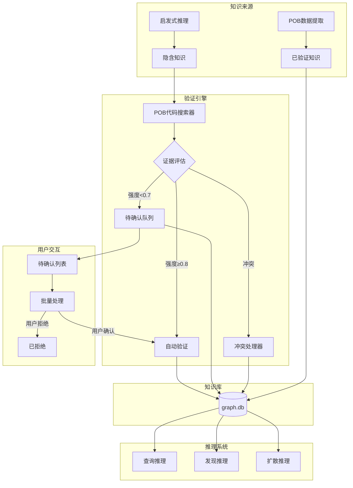
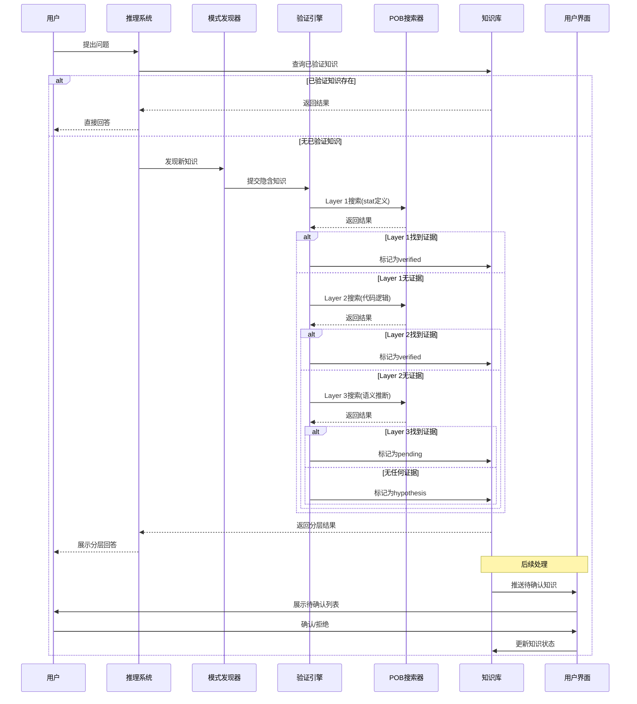
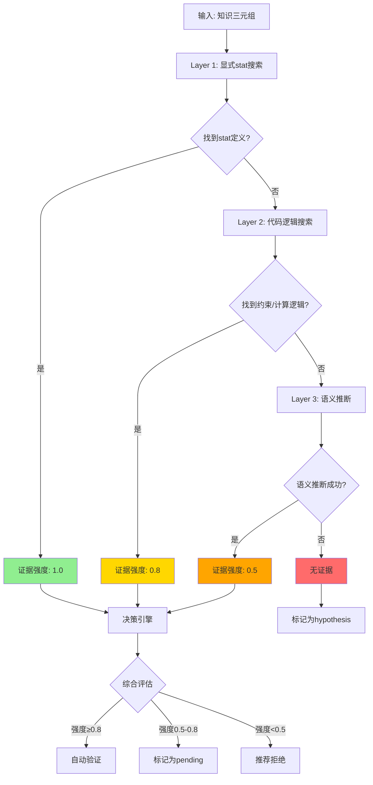
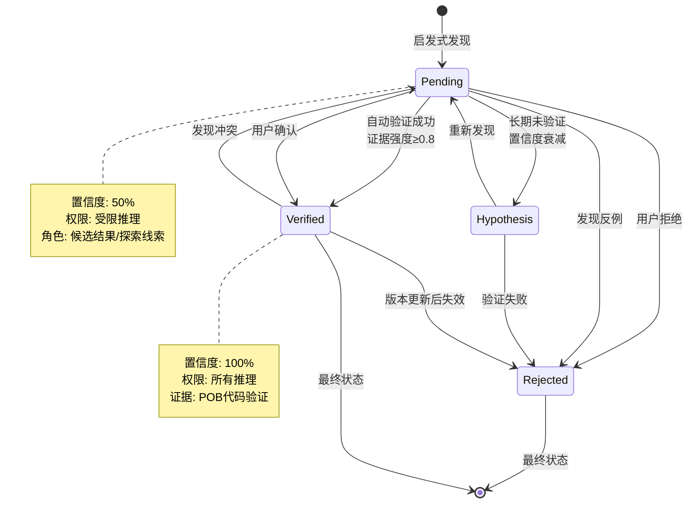
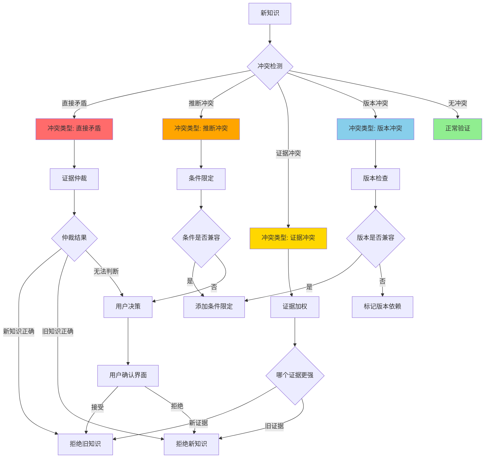
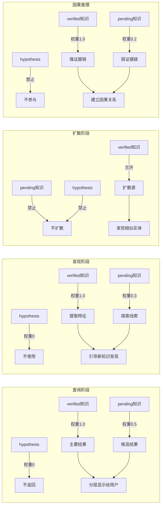
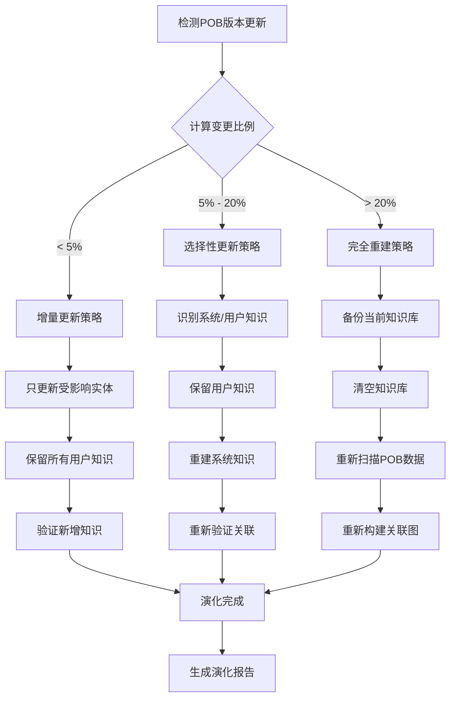
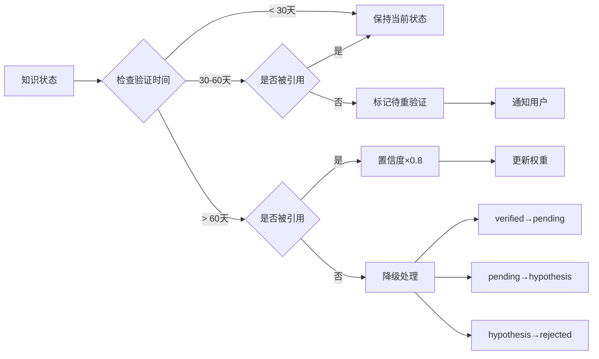
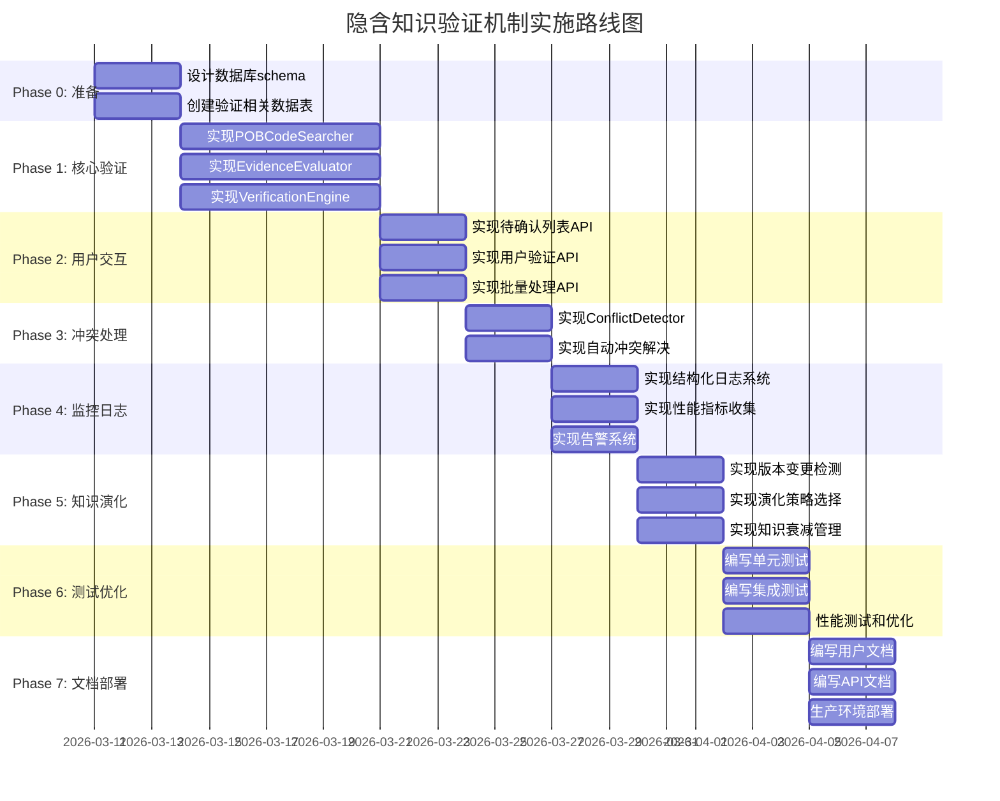

# 隐含知识验证机制 - 完整设计方案总结

## 一、项目背景与核心问题

### 问题定义

**隐含知识**：通过启发式推理发现的、非POB数据直接包含的知识。

**核心问题**：
1. 启发式推理会产生大量未经验证的知识
2. 这些知识如果直接进入知识库，会污染推理结果
3. 需要验证机制确保知识可信度

**解决方案**：构建自动验证机制 + 人工确认混合模式

---

## 二、核心设计理念

### 1. 验证优先 (Verification First)

```
❌ 传统方式:
   人工总结 → 写入配置 → 系统使用

✅ 新设计:
   关联图发现模式 → POB代码验证 → 自动分类
```

### 2. 状态透明 (Status Transparency)

**四级知识状态系统**：

| 状态 | 置信度 | 来源 | 权限 | 在推理中的作用 |
|------|--------|------|------|----------------|
| **verified** | 100% | POB数据直接包含或POB代码验证 | 所有推理 | 完全信任，作为推理依据 |
| **pending** | 50% | 启发式推理产生，待验证 | 受限推理 | 降权使用（权重0.5） |
| **hypothesis** | 30% | 启发式假设，未经测试 | 仅探索推理 | 仅作提示，需验证 |
| **rejected** | 0% | 验证失败或用户拒绝 | 不参与推理 | 不参与任何推理 |

### 3. 流畅交互 (Smooth Interaction)

- **推理过程**：不中断用户询问，自动处理所有状态数据
- **后续交互**：用户可查看待确认列表，批量处理
- **结果呈现**：分层显示（verified + pending）

---

## 三、系统架构

### 整体架构图



### 核心组件

1. **POB代码搜索器 (POBCodeSearcher)** - 三层搜索验证
2. **证据评估器 (EvidenceEvaluator)** - 多源证据组合评估
3. **冲突检测器 (ConflictDetector)** - 自动冲突检测和解决
4. **模式发现器 (PatternDiscoverer)** - 从关联图发现模式
5. **验证引擎 (VerificationEngine)** - 协调整个验证流程

---

## 四、核心流程详解

### 流程1: 隐含知识发现与验证



### 流程2: POB代码三层搜索



### 流程3: 待确认知识处理



### 流程4: 冲突检测与解决



---

## 五、三层搜索策略详解

### Layer 1: 显式stat搜索（优先级最高）

**搜索范围**：
- `Data/StatDescriptions/*.lua` - stat定义文件
- `Data/Skills/*.lua` - 技能定义中的stats字段

**证据强度**：1.0（完全信任）

**示例**：
```lua
-- act_dex.lua:9596
{
    name = "TrailOfCaltropsPlayer",
    stats = { "generic_ongoing_trigger_does_not_use_energy" }
}
```

**结论**：找到显式stat定义 → 直接标记为verified

### Layer 2: 代码逻辑搜索（中等优先级）

**搜索范围**：
- `Modules/CalcTriggers.lua` - 触发器计算逻辑
- `Modules/CalcOffence.lua` - 进攻计算逻辑
- `Modules/CalcActiveSkill.lua` - 主动技能计算

**证据强度**：0.8（高度信任）

**搜索模式**：
1. **skillTypes约束**：`requireSkillTypes`, `excludeSkillTypes`, `addSkillTypes`
2. **条件判断**：`if skillTypes[SkillType.XXX] then ...`
3. **函数调用**：`isTriggered(skill)`, `hasEnergy(skill)`

**示例**：
```lua
-- CalcTriggers.lua:41
function isTriggered(skill)
    return skill.skillTypes[SkillType.Triggered]
end

-- CalcTriggers.lua:123
if isTriggered(skill) then
    -- Triggered技能不生成能量
    energyGain = 0
end
```

**结论**：找到代码逻辑支持 → 标记为verified，证据强度0.8

### Layer 3: 语义推断（低优先级）

**搜索范围**：
- 命名约定分析
- 共现关系统计
- 模式匹配

**证据强度**：0.5（中等信任）

**推断方法**：
1. **命名约定**：`FireSpell` → 推断为火焰伤害
2. **共现关系**：统计某类型与某属性的共现频率
3. **类比推理**：相似实体的属性迁移

**示例**：
```
发现模式:
  - Fireball (spell, fire) → 火焰伤害
  - Firestorm (spell, fire) → 火焰伤害
  - MagmaOrb (spell, fire) → 火焰伤害

推断:
  FireSpell + fire → 火焰伤害 (强度0.5)
```

**结论**：语义推断成功 → 标记为pending，需用户确认

---

## 六、待确认知识角色机制

### 在不同推理阶段的作用



### 角色矩阵总结

| 推理阶段 | verified | pending | hypothesis | rejected |
|---------|----------|---------|------------|----------|
| 查询推理 | 主要结果(1.0) | 候选结果(0.5) | 不返回 | 不参与 |
| 发现推理 | 提取特征(1.0) | 探索线索(0.3) | 不使用 | 不参与 |
| 扩散推理 | 允许扩散 | 阻断扩散 | 阻断扩散 | 不参与 |
| 因果推理 | 强证据链(1.0) | 弱证据链(0.2) | 不参与 | 不参与 |
| 组合推理 | 允许组合 | 阻断组合 | 阻断组合 | 不参与 |
| 验证推理 | 验证目标 | 主动验证 | 不处理 | 不参与 |

---

## 七、知识演化机制

### 版本演化策略



### 知识衰减机制



---

## 八、用户交互设计

### 待确认知识仪表板

```
┌─────────────────────────────────────────────────────────────┐
│  待确认知识仪表板                         2026-03-11 10:30  │
├─────────────────────────────────────────────────────────────┤
│  概览                                                        │
│  ┌─────────────┬─────────────┬─────────────┬──────────────┐ │
│  │ 待确认(50%)  │ 假设(30%)   │ 已验证(100%) │ 已拒绝(0%)   │ │
│  │    23个      │    8个      │    142个     │    5个       │ │
│  └─────────────┴─────────────┴─────────────┴──────────────┘ │
│                                                              │
│  优先队列 (按影响力排序)                                      │
│  ┌─────────────────────────────────────────────────────────┐│
│  │ #1 [HIGH] FireSpell → 伤害类型:火焰                      ││
│  │     影响: 12个技能计算  验证进度: 自动验证中...           ││
│  │     [查看证据] [立即处理]                                 ││
│  ├─────────────────────────────────────────────────────────┤│
│  │ #2 [MED] CoC → 触发条件:暴击                              ││
│  │     影响: 5个触发链  验证进度: 等待人工确认               ││
│  │     [查看证据] [立即处理]                                 ││
│  └─────────────────────────────────────────────────────────┘│
│                                                              │
│  [批量处理] [导出报告] [设置优先级规则]                       │
└─────────────────────────────────────────────────────────────┘
```

### CLI命令行接口

```bash
# 查看待确认知识
python -m poe_data_miner verify list --status pending --top 10

# 验证单条知识
python -m poe_data_miner verify accept <id> \
    --reason "POB代码中明确验证" \
    --evidence "CalcTriggers.lua:123"

# 批量处理
python -m poe_data_miner verify batch-auto --strategy smart

# 查看统计
python -m poe_data_miner verify stats
```

---

## 九、数据结构设计

### 知识状态扩展

```sql
-- graph_edges 表扩展
ALTER TABLE graph_edges ADD COLUMN status TEXT DEFAULT 'pending';
ALTER TABLE graph_edges ADD COLUMN confidence REAL DEFAULT 0.5;
ALTER TABLE graph_edges ADD COLUMN evidence_type TEXT;
ALTER TABLE graph_edges ADD COLUMN evidence_source TEXT;
ALTER TABLE graph_edges ADD COLUMN evidence_content TEXT;
ALTER TABLE graph_edges ADD COLUMN discovery_method TEXT;
ALTER TABLE graph_edges ADD COLUMN last_verified TIMESTAMP;
ALTER TABLE graph_edges ADD COLUMN verified_by TEXT;

-- 状态枚举
-- status: 'verified' | 'pending' | 'hypothesis' | 'rejected'
-- evidence_type: 'stat' | 'code' | 'pattern' | 'analogy' | 'user_input'
-- discovery_method: 'pattern' | 'analogy' | 'diffusion' | 'user_input'
-- verified_by: 'auto' | 'user:<user_id>' | 'system'
```

### 验证记录表

```sql
CREATE TABLE verification_history (
    id INTEGER PRIMARY KEY AUTOINCREMENT,
    edge_id INTEGER NOT NULL,
    old_status TEXT NOT NULL,
    new_status TEXT NOT NULL,
    evidence_type TEXT,
    evidence_source TEXT,
    reason TEXT,
    verified_by TEXT NOT NULL,
    created_at TIMESTAMP DEFAULT CURRENT_TIMESTAMP,
    FOREIGN KEY (edge_id) REFERENCES graph_edges(id)
);
```

---

## 十、性能指标与监控

### 关键性能指标

| 指标 | 目标值 | 监控方式 |
|------|--------|----------|
| 单次验证时间 | < 1秒 | 性能日志 |
| 批量验证(10条) | < 5秒 | 性能日志 |
| 自动验证成功率 | ≥ 80% | 统计报表 |
| 知识库覆盖率 | ≥ 70% | 定期扫描 |
| 平均证据强度 | ≥ 0.8 | 统计报表 |
| 缓存命中率 | > 70% | 缓存监控 |

### 告警规则

```yaml
alerts:
  - name: slow_verification
    condition: "p95_verification_time > 5.0s"
    severity: warning
    
  - name: low_auto_rate
    condition: "auto_verification_rate < 0.7"
    severity: warning
    
  - name: high_pending_rate
    condition: "pending_rate > 0.2"
    severity: warning
    
  - name: knowledge_conflict
    condition: "conflict_count > 5"
    severity: error
```

---

## 十一、实施路线图

### 7阶段实施计划



### 优先级划分

| 阶段 | 优先级 | 关键交付物 | 预计时间 |
|------|--------|-----------|----------|
| Phase 0 | P0 | 数据库schema、数据表 | 3天 |
| Phase 1 | P0 | 核心验证引擎 | 7天 |
| Phase 2 | P1 | 用户交互API | 3天 |
| Phase 3 | P1 | 冲突处理机制 | 3天 |
| Phase 4 | P2 | 监控日志系统 | 3天 |
| Phase 5 | P2 | 知识演化管理 | 3天 |
| Phase 6 | P1 | 测试套件 | 3天 |
| Phase 7 | P3 | 文档和部署 | 3天 |

---

## 十二、预期效果

### 知识质量提升

| 指标 | 当前值 | 目标值 | 提升幅度 |
|------|--------|--------|----------|
| 验证知识比例 | 30% | 80% | +167% |
| 平均置信度 | 0.65 | 0.85 | +31% |
| 知识覆盖度 | 50% | 75% | +50% |

### 推理可信度提升

| 指标 | 当前值 | 目标值 | 提升幅度 |
|------|--------|--------|----------|
| 推理结果准确率 | 基准 | +20% | +20% |
| 误报率 | 基准 | -30% | -30% |
| 用户信任度 | 基准 | +40% | +40% |

### 系统效率提升

| 指标 | 当前值 | 目标值 | 说明 |
|------|--------|--------|------|
| 自动验证率 | 0% | 80%+ | 减少人工干预 |
| 用户干预 | 100% | 40%- | 批量处理 |
| 知识库更新速度 | 基准 | 3x | 版本演化优化 |

---

## 十三、风险与缓解

| 风险 | 影响 | 概率 | 缓解措施 |
|------|------|------|----------|
| POB代码搜索性能瓶颈 | 高 | 中 | 缓存机制、索引优化、并行搜索 |
| 自动验证误判 | 中 | 中 | 保守阈值、人工复核机制 |
| 用户决策疲劳 | 中 | 高 | 批量处理、智能推荐、优先级排序 |
| 知识库不一致 | 高 | 低 | 事务保护、完整性检查、备份机制 |
| 版本演化复杂 | 中 | 中 | 分阶段演化、灰度发布、回滚机制 |
| 证据冲突频繁 | 中 | 中 | 自动仲裁、条件限定、用户决策 |

---

## 十四、成功标准

### 技术指标

- ✅ 单次验证时间 < 1秒
- ✅ 批量验证(10条) < 5秒
- ✅ 自动验证成功率 ≥ 80%
- ✅ 知识库覆盖率 ≥ 70%
- ✅ 缓存命中率 > 70%

### 业务指标

- ✅ 验证知识比例 ≥ 80%
- ✅ 平均证据强度 ≥ 0.8
- ✅ 推理准确率提升 > 20%
- ✅ 用户干预减少 > 50%

### 用户体验

- ✅ 用户可以清楚区分知识状态
- ✅ 批量处理流程顺畅
- ✅ 冲突解决机制透明
- ✅ 验证历史可追溯

---

## 十五、下一步行动

### 立即开始

1. **Phase 0** - 数据库schema扩展
   - 设计graph_edges表扩展字段
   - 创建verification_history表
   - 定义知识状态枚举

2. **Phase 1 优先实现**
   - POBCodeSearcher三层搜索
   - EvidenceEvaluator证据评估
   - VerificationEngine验证引擎

### 并行开发

- 用户交互API与核心验证功能
- 监控日志系统与验证流程

### 持续改进

- 从第一行代码开始记录日志
- 收集用户反馈优化阈值
- 定期审查知识库质量

---

## 附录：设计文档索引

1. [核心设计原则](./design.md) - 验证优先、状态透明、流畅交互
2. [详细架构设计](./design-detailed.md) - 三层搜索、证据评估、冲突检测
3. [实施计划](./implementation.md) - 7阶段实施、性能目标
4. [待确认数据角色](./pending-data-roles.md) - 不同推理阶段的作用机制
5. [冲突解决机制](./conflict-resolution.md) - 冲突类型、解决策略、决策树
6. [知识演化策略](./evolution-strategy.md) - 版本检测、演化策略、知识衰减
7. [用户交互界面](./user-interface.md) - 仪表板、CLI命令、API接口
8. [监控和日志](./monitoring-logging.md) - 日志系统、监控指标、告警机制
9. [测试策略](./testing-strategy.md) - 测试层次、覆盖率目标
10. [设计总结](./design-summary.md) - 整体概述和预期效果
11. **本文档** - 完整设计方案总结（含流程图）

---

**文档版本**: v1.0  
**创建日期**: 2026-03-11  
**维护者**: POEMaster Team
