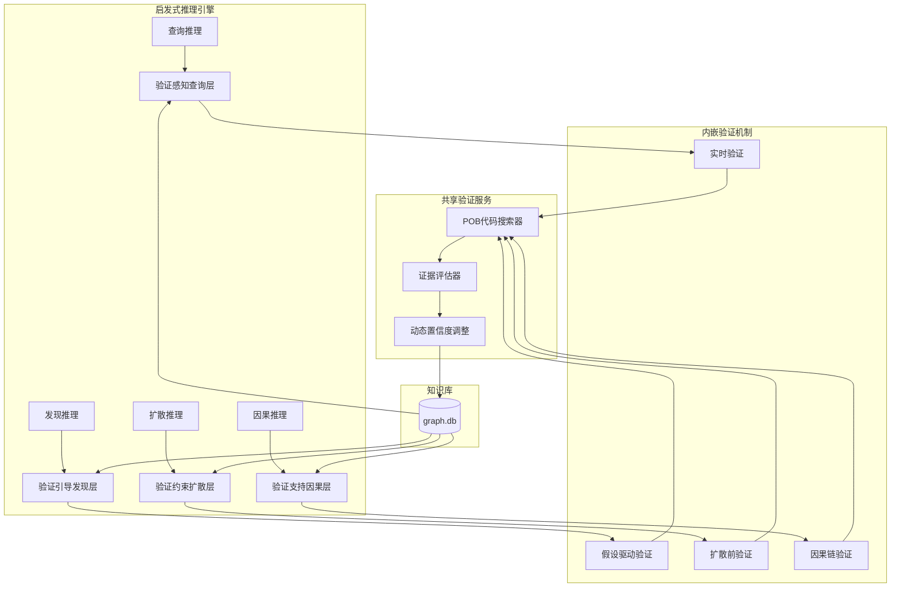
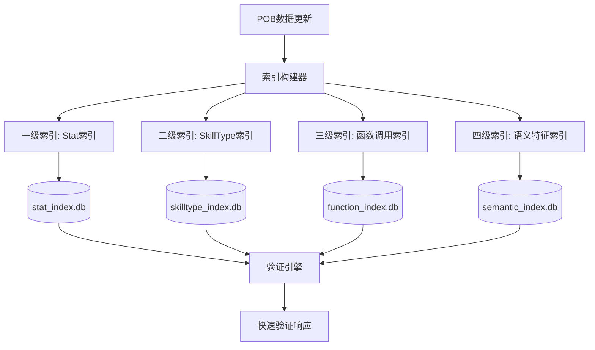

# 深度集成与优化策略

## 一、启发式推理深度集成

### 1.1 当前问题分析

**现有架构的局限**：
```
当前流程：
启发式推理 → 发现隐含知识 → 验证机制（独立）
                  ↓
              知识库更新
```

**问题**：
- 验证机制与推理系统分离，增加复杂度
- 推理过程中无法利用验证信息
- pending知识的角色未充分发挥

### 1.2 深度集成架构



### 1.3 各推理层的深度集成方案

#### 1.3.1 查询推理层：验证感知查询

**核心思想**：查询过程中自动触发验证，实时调整结果置信度

```python
class VerificationAwareQueryEngine:
    """验证感知的查询引擎"""
    
    def query_with_verification(self, query: dict) -> dict:
        """
        查询时自动验证pending知识
        
        流程：
        1. 收集verified + pending知识
        2. 对pending知识进行实时验证
        3. 动态调整置信度
        4. 返回分层结果
        """
        
        # Step 1: 收集候选
        verified = self.query_edges(status='verified', **query)
        pending = self.query_edges(status='pending', **query)
        
        # Step 2: 实时验证pending知识
        verification_tasks = []
        for edge in pending[:10]:  # 限制验证数量
            if self.should_verify(edge):
                verification_tasks.append(
                    self.verify_edge_async(edge)
                )
        
        # Step 3: 等待验证结果（带超时）
        verification_results = await asyncio.gather(
            *verification_tasks,
            timeout=2.0  # 2秒超时
        )
        
        # Step 4: 更新状态和置信度
        for edge, result in zip(pending[:10], verification_results):
            if result.success:
                self.update_edge_status(edge.id, 'verified', result.evidence)
                edge.status = 'verified'
                edge.confidence = 1.0
            elif result.evidence_strength < 0.5:
                self.update_edge_status(edge.id, 'rejected', result.evidence)
                pending.remove(edge)  # 移除已拒绝的知识
        
        # Step 5: 组合结果
        return {
            'verified': verified + [e for e in pending if e.status == 'verified'],
            'pending': [e for e in pending if e.status == 'pending'],
            'verification_performed': len(verification_tasks)
        }
    
    def should_verify(self, edge: dict) -> bool:
        """判断是否需要验证"""
        # 策略1: 从未验证过
        if edge.get('last_verified') is None:
            return True
        
        # 策略2: 高影响度知识
        if edge.get('impact_score', 0) > 10:
            return True
        
        # 策略3: 查询频率高
        if edge.get('query_count', 0) > 5:
            return True
        
        return False
```

**优化点**：
- 异步验证，不阻塞查询
- 智能验证触发（高影响、高频查询优先）
- 验证结果实时反馈

#### 1.3.2 发现推理层：验证引导发现

**核心思想**：利用pending知识作为探索线索，引导新知识发现

```python
class VerificationGuidedDiscovery:
    """验证引导的发现引擎"""
    
    def discover_with_pending_guidance(self, target: str) -> dict:
        """
        利用pending知识引导发现
        
        流程：
        1. 从verified知识提取高置信特征
        2. 从pending知识提取潜在特征（降权）
        3. 组合特征引导搜索
        4. 发现新知识时立即验证
        """
        
        # Step 1: 提取verified特征
        verified_edges = self.query_edges(status='verified', target=target)
        verified_features = self.extract_features(verified_edges)
        
        # Step 2: 提取pending特征（作为线索）
        pending_edges = self.query_edges(status='pending', target=target)
        pending_features = self.extract_features(
            pending_edges,
            weight=0.3  # 降低权重
        )
        
        # Step 3: 特征融合
        search_space = self.merge_features({
            'primary': verified_features,      # 主导方向
            'exploratory': pending_features    # 探索方向
        })
        
        # Step 4: 引导搜索
        candidates = self.search_similar_entities(search_space)
        
        # Step 5: 发现新知识时立即验证
        discoveries = []
        for candidate in candidates:
            # 发现新的潜在绕过路径
            implication = self.detect_implication(candidate, target)
            
            if implication:
                # 立即验证
                evidence = self.verify_implication(
                    source=candidate,
                    target=target,
                    context=implication
                )
                
                # 根据验证结果创建边
                edge = self.create_edge_with_evidence(
                    source=candidate,
                    target=target,
                    evidence=evidence
                )
                
                discoveries.append({
                    'entity': candidate,
                    'edge': edge,
                    'evidence_strength': evidence['strength']
                })
        
        return {
            'discoveries': discoveries,
            'verified_count': sum(1 for d in discoveries if d['edge']['status'] == 'verified'),
            'pending_count': sum(1 for d in discoveries if d['edge']['status'] == 'pending')
        }
    
    def extract_features(self, edges: list, weight: float = 1.0) -> dict:
        """提取特征并调整权重"""
        features = {}
        
        for edge in edges:
            source_features = self.get_entity_features(edge['source'])
            
            for feature, value in source_features.items():
                if feature not in features:
                    features[feature] = 0.0
                
                # 累加加权特征
                features[feature] += value * weight
        
        return features
```

**优化点**：
- pending知识作为探索线索而非障碍
- 发现即验证，减少pending积累
- 特征融合考虑验证状态

#### 1.3.3 扩散推理层：验证约束扩散

**核心思想**：扩散时自动验证候选，只扩散验证通过的知识

```python
class VerificationConstrainedDiffusion:
    """验证约束的扩散引擎"""
    
    def diffuse_with_verification(self, seed_entities: list) -> dict:
        """
        扩散时验证候选
        
        流程：
        1. 从verified种子开始扩散
        2. 找到相似实体后立即验证
        3. 只有验证通过的才能成为新种子
        4. 控制扩散深度和宽度
        """
        
        # 初始化
        verified_seeds = [e for e in seed_entities if e['status'] == 'verified']
        diffusion_frontier = verified_seeds.copy()
        discovered = []
        max_depth = 3
        
        for depth in range(max_depth):
            next_frontier = []
            
            for seed in diffusion_frontier:
                # 找相似实体
                similar = self.find_similar_entities(
                    entity=seed,
                    min_similarity=0.7,
                    exclude=verified_seeds + discovered
                )
                
                # 立即验证每个候选
                for candidate in similar:
                    evidence = self.verify_similarity(
                        source=seed,
                        candidate=candidate
                    )
                    
                    if evidence['strength'] >= 0.7:
                        # 创建verified边
                        edge = self.create_verified_edge(
                            source=seed,
                            target=candidate,
                            evidence=evidence
                        )
                        
                        next_frontier.append(candidate)
                        discovered.append(candidate)
                    elif evidence['strength'] >= 0.5:
                        # 创建pending边
                        edge = self.create_pending_edge(
                            source=seed,
                            target=candidate,
                            evidence=evidence
                        )
                        # pending边不继续扩散
        
            diffusion_frontier = next_frontier
            
            if not diffusion_frontier:
                break
        
        return {
            'discovered': discovered,
            'depth_reached': depth + 1,
            'verified_edges': len([d for d in discovered if d['verified']])
        }
```

**优化点**：
- 扩散前验证，阻断pending传播
- 只扩散verified知识
- 控制扩散范围，避免噪音

#### 1.3.4 因果推理层：验证支持因果链

**核心思想**：因果链中每个环节都需要验证，建立强证据链

```python
class VerificationSupportedCausalChain:
    """验证支持的因果链推理"""
    
    def build_causal_chain(self, start: str, end: str) -> dict:
        """
        构建验证的因果链
        
        流程：
        1. 搜索可能的路径
        2. 验证每条边
        3. 计算整条链的综合置信度
        4. 返回最强因果链
        """
        
        # Step 1: 搜索所有可能路径
        all_paths = self.find_all_paths(start, end, max_length=5)
        
        # Step 2: 验证每条路径的每条边
        verified_paths = []
        
        for path in all_paths:
            verified_path = []
            chain_evidence = []
            
            for i in range(len(path) - 1):
                source = path[i]
                target = path[i + 1]
                
                # 查询或验证边
                edge = self.get_or_verify_edge(source, target)
                
                if edge['status'] == 'rejected':
                    # 这条路径断裂
                    verified_path = None
                    break
                
                verified_path.append(edge)
                chain_evidence.append(edge['evidence'])
            
            if verified_path:
                # 计算综合置信度
                chain_confidence = self.calculate_chain_confidence(verified_path)
                
                verified_paths.append({
                    'path': path,
                    'edges': verified_path,
                    'confidence': chain_confidence,
                    'evidence': chain_evidence
                })
        
        # Step 3: 排序返回最强因果链
        verified_paths.sort(key=lambda x: x['confidence'], reverse=True)
        
        return {
            'best_chain': verified_paths[0] if verified_paths else None,
            'all_chains': verified_paths[:5],  # 返回前5条
            'total_verified': len(verified_paths)
        }
    
    def calculate_chain_confidence(self, edges: list) -> float:
        """计算因果链综合置信度"""
        # 方法：几何平均（对弱环节敏感）
        confidences = [e['confidence'] for e in edges]
        
        geometric_mean = np.prod(confidences) ** (1 / len(confidences))
        
        return geometric_mean
```

**优化点**：
- 因果链中每条边都验证
- 几何平均置信度，对弱环节敏感
- 返回多条候选链供用户选择

---

## 二、POB代码索引策略优化

### 2.1 当前问题分析

**现状**：每次验证都需要扫描POB代码文件，性能瓶颈明显

```
验证请求 → 扫描文件 → grep搜索 → 返回结果
           ↓
        重复扫描
        性能差
```

### 2.2 多级索引架构



### 2.3 各级索引设计

#### 2.3.1 一级索引：Stat索引

**目标**：快速定位stat定义和使用位置

```python
class StatIndex:
    """Stat一级索引"""
    
    def __init__(self, db_path: str):
        self.db_path = db_path
        self.create_index_table()
    
    def create_index_table(self):
        """创建索引表"""
        conn = sqlite3.connect(self.db_path)
        conn.execute('''
            CREATE TABLE IF NOT EXISTS stat_index (
                stat_id TEXT PRIMARY KEY,
                stat_name TEXT NOT NULL,
                definition_file TEXT,
                definition_line INTEGER,
                definition_context TEXT,
                usage_count INTEGER DEFAULT 0,
                last_updated TIMESTAMP DEFAULT CURRENT_TIMESTAMP
            )
        ''')
        
        conn.execute('''
            CREATE TABLE IF NOT EXISTS stat_usage (
                id INTEGER PRIMARY KEY AUTOINCREMENT,
                stat_id TEXT NOT NULL,
                skill_name TEXT NOT NULL,
                file_path TEXT NOT NULL,
                line_number INTEGER,
                context TEXT,
                FOREIGN KEY (stat_id) REFERENCES stat_index(stat_id)
            )
        ''')
        
        # 创建索引
        conn.execute('CREATE INDEX IF NOT EXISTS idx_stat_id ON stat_usage(stat_id)')
        conn.execute('CREATE INDEX IF NOT EXISTS idx_skill_name ON stat_usage(skill_name)')
        
        conn.commit()
    
    def index_stat_definitions(self, pob_data_path: str):
        """索引所有stat定义"""
        conn = sqlite3.connect(self.db_path)
        
        # 扫描 StatDescriptions 目录
        stat_desc_dir = Path(pob_data_path) / 'Data' / 'StatDescriptions'
        
        for lua_file in stat_desc_dir.glob('*.lua'):
            self.index_stat_file(lua_file, conn)
        
        # 扫描技能文件中的stats字段
        skills_dir = Path(pob_data_path) / 'Data' / 'Skills'
        
        for lua_file in skills_dir.glob('*.lua'):
            self.index_skill_stats(lua_file, conn)
        
        conn.commit()
    
    def search_stat(self, stat_id: str) -> dict:
        """快速搜索stat"""
        conn = sqlite3.connect(self.db_path)
        
        # 查询定义
        definition = conn.execute(
            'SELECT * FROM stat_index WHERE stat_id = ?',
            (stat_id,)
        ).fetchone()
        
        # 查询使用
        usages = conn.execute(
            'SELECT * FROM stat_usage WHERE stat_id = ?',
            (stat_id,)
        ).fetchall()
        
        return {
            'found': definition is not None,
            'definition': definition,
            'usages': usages,
            'usage_count': len(usages)
        }
```

**性能提升**：
- 查询时间：秒级 → 毫秒级
- 支持模糊搜索（LIKE查询）
- 统计使用频率

#### 2.3.2 二级索引：SkillType索引

**目标**：快速定位skillTypes约束关系

```python
class SkillTypeIndex:
    """SkillType二级索引"""
    
    def create_index_table(self):
        """创建索引表"""
        conn = sqlite3.connect(self.db_path)
        
        conn.execute('''
            CREATE TABLE IF NOT EXISTS skilltype_index (
                skill_type TEXT PRIMARY KEY,
                type_name TEXT NOT NULL,
                description TEXT,
                related_stats TEXT,  -- JSON array
                last_updated TIMESTAMP
            )
        ''')
        
        conn.execute('''
            CREATE TABLE IF NOT EXISTS skilltype_constraints (
                id INTEGER PRIMARY KEY AUTOINCREMENT,
                skill_type TEXT NOT NULL,
                constraint_type TEXT NOT NULL,  -- 'require', 'exclude', 'add'
                skill_name TEXT NOT NULL,
                file_path TEXT NOT NULL,
                line_number INTEGER,
                context TEXT,
                FOREIGN KEY (skill_type) REFERENCES skilltype_index(skill_type)
            )
        ''')
        
        conn.commit()
    
    def search_skilltype_constraints(self, skill_type: str) -> dict:
        """搜索skillType约束"""
        conn = sqlite3.connect(self.db_path)
        
        required = conn.execute(
            'SELECT * FROM skilltype_constraints WHERE skill_type = ? AND constraint_type = ?',
            (skill_type, 'require')
        ).fetchall()
        
        excluded = conn.execute(
            'SELECT * FROM skilltype_constraints WHERE skill_type = ? AND constraint_type = ?',
            (skill_type, 'exclude')
        ).fetchall()
        
        added = conn.execute(
            'SELECT * FROM skilltype_constraints WHERE skill_type = ? AND constraint_type = ?',
            (skill_type, 'add')
        ).fetchall()
        
        return {
            'skill_type': skill_type,
            'required_by': required,
            'excluded_by': excluded,
            'added_by': added,
            'total_constraints': len(required) + len(excluded) + len(added)
        }
```

**优势**：
- 快速查询某类型的所有约束
- 支持反向查询（哪些技能约束了某类型）
- 识别类型关系

#### 2.3.3 三级索引：函数调用索引

**目标**：快速定位CalcModules中的函数和调用关系

```python
class FunctionCallIndex:
    """函数调用三级索引"""
    
    def create_index_table(self):
        """创建索引表"""
        conn = sqlite3.connect(self.db_path)
        
        conn.execute('''
            CREATE TABLE IF NOT EXISTS function_index (
                function_name TEXT PRIMARY KEY,
                file_path TEXT NOT NULL,
                start_line INTEGER,
                end_line INTEGER,
                parameters TEXT,  -- JSON array
                return_type TEXT,
                description TEXT,
                last_updated TIMESTAMP
            )
        ''')
        
        conn.execute('''
            CREATE TABLE IF NOT EXISTS function_calls (
                id INTEGER PRIMARY KEY AUTOINCREMENT,
                caller_function TEXT NOT NULL,
                caller_file TEXT NOT NULL,
                caller_line INTEGER,
                callee_function TEXT NOT NULL,
                call_context TEXT,
                FOREIGN KEY (callee_function) REFERENCES function_index(function_name)
            )
        ''')
        
        conn.commit()
    
    def search_function(self, function_name: str) -> dict:
        """搜索函数定义和调用"""
        conn = sqlite3.connect(self.db_path)
        
        definition = conn.execute(
            'SELECT * FROM function_index WHERE function_name = ?',
            (function_name,)
        ).fetchone()
        
        callers = conn.execute(
            'SELECT * FROM function_calls WHERE callee_function = ?',
            (function_name,)
        ).fetchall()
        
        callees = conn.execute(
            'SELECT * FROM function_calls WHERE caller_function = ?',
            (function_name,)
        ).fetchall()
        
        return {
            'definition': definition,
            'called_by': callers,
            'calls_to': callees,
            'call_graph_depth': self.calculate_call_depth(function_name)
        }
```

**用途**：
- 快速定位关键函数（如`isTriggered`, `hasEnergy`）
- 构建调用图，分析因果关系
- 支持函数级别的验证

#### 2.3.4 四级索引：语义特征索引

**目标**：支持语义级别的快速搜索

```python
class SemanticFeatureIndex:
    """语义特征四级索引"""
    
    def create_index_table(self):
        """创建索引表"""
        conn = sqlite3.connect(self.db_path)
        
        conn.execute('''
            CREATE TABLE IF NOT EXISTS entity_features (
                entity_name TEXT PRIMARY KEY,
                feature_vector BLOB,  -- 序列化的特征向量
                keywords TEXT,  -- JSON array of keywords
                tags TEXT,  -- JSON array of tags
                description TEXT,
                last_updated TIMESTAMP
            )
        ''')
        
        conn.execute('''
            CREATE TABLE IF NOT EXISTS feature_similarity_cache (
                id INTEGER PRIMARY KEY AUTOINCREMENT,
                entity1 TEXT NOT NULL,
                entity2 TEXT NOT NULL,
                similarity_score REAL,
                common_features TEXT,  -- JSON array
                last_computed TIMESTAMP,
                UNIQUE(entity1, entity2)
            )
        ''')
        
        conn.commit()
    
    def search_similar_entities(self, entity: str, top_k: int = 10) -> list:
        """搜索相似实体（使用缓存）"""
        conn = sqlite3.connect(self.db_path)
        
        # 尝试从缓存读取
        cached = conn.execute(
            '''SELECT entity2, similarity_score 
               FROM feature_similarity_cache 
               WHERE entity1 = ? 
               ORDER BY similarity_score DESC 
               LIMIT ?''',
            (entity, top_k)
        ).fetchall()
        
        if cached:
            return cached
        
        # 缓存未命中，计算相似度
        entity_features = conn.execute(
            'SELECT feature_vector FROM entity_features WHERE entity_name = ?',
            (entity,)
        ).fetchone()
        
        if not entity_features:
            return []
        
        # 计算与所有实体的相似度（简化版，实际应使用向量索引）
        all_entities = conn.execute(
            'SELECT entity_name, feature_vector FROM entity_features'
        ).fetchall()
        
        similarities = []
        for other_name, other_features in all_entities:
            if other_name != entity:
                sim = self.calculate_similarity(entity_features[0], other_features)
                similarities.append((other_name, sim))
        
        # 排序并缓存
        similarities.sort(key=lambda x: x[1], reverse=True)
        top_results = similarities[:top_k]
        
        # 缓存结果
        for other_name, sim in top_results:
            conn.execute(
                '''INSERT OR REPLACE INTO feature_similarity_cache 
                   (entity1, entity2, similarity_score, last_computed) 
                   VALUES (?, ?, ?, ?)''',
                (entity, other_name, sim, datetime.now())
            )
        
        conn.commit()
        
        return top_results
```

**优势**：
- 快速语义搜索
- 相似度缓存
- 支持模糊匹配

### 2.4 索引维护策略

```python
class IndexManager:
    """索引管理器"""
    
    def __init__(self, pob_data_path: str):
        self.pob_path = pob_data_path
        self.indexes = {
            'stat': StatIndex('indexes/stat_index.db'),
            'skilltype': SkillTypeIndex('indexes/skilltype_index.db'),
            'function': FunctionCallIndex('indexes/function_index.db'),
            'semantic': SemanticFeatureIndex('indexes/semantic_index.db')
        }
    
    def build_all_indexes(self):
        """构建所有索引"""
        logger.info("开始构建索引...")
        
        start_time = time.time()
        
        # 并行构建索引
        with ThreadPoolExecutor(max_workers=4) as executor:
            futures = {
                executor.submit(self.indexes['stat'].index_stat_definitions, self.pob_path): 'stat',
                executor.submit(self.indexes['skilltype'].index_skilltype_constraints, self.pob_path): 'skilltype',
                executor.submit(self.indexes['function'].index_calc_functions, self.pob_path): 'function',
                executor.submit(self.indexes['semantic'].index_entity_features, self.pob_path): 'semantic'
            }
            
            for future in as_completed(futures):
                index_name = futures[future]
                try:
                    future.result()
                    logger.info(f"{index_name} 索引构建完成")
                except Exception as e:
                    logger.error(f"{index_name} 索引构建失败: {e}")
        
        duration = time.time() - start_time
        logger.info(f"所有索引构建完成，耗时 {duration:.2f} 秒")
    
    def incremental_update(self, changed_files: list):
        """增量更新索引"""
        for file_path in changed_files:
            # 判断文件类型
            if 'StatDescriptions' in file_path:
                self.indexes['stat'].update_index(file_path)
            elif 'Skills' in file_path:
                self.indexes['stat'].update_skill_stats(file_path)
                self.indexes['skilltype'].update_constraints(file_path)
            elif 'Modules' in file_path and 'Calc' in file_path:
                self.indexes['function'].update_functions(file_path)
    
    def check_index_health(self) -> dict:
        """检查索引健康状态"""
        health = {}
        
        for name, index in self.indexes.items():
            db_path = index.db_path
            
            if not os.path.exists(db_path):
                health[name] = {'status': 'missing', 'size': 0}
            else:
                size = os.path.getsize(db_path)
                mtime = datetime.fromtimestamp(os.path.getmtime(db_path))
                
                health[name] = {
                    'status': 'healthy',
                    'size': size,
                    'last_modified': mtime
                }
        
        return health
```

---

## 三、模式发现的更多策略

### 3.1 当前策略局限

**现有模式发现**：
- 类型-属性模式（FireSpell → FireDamage）
- 因果模式（Trigger → EnergyCost）
- 绕过模式（SpecialStat → NoEnergy）

**局限**：
- 依赖人工定义模式类型
- 缺乏自动化模式挖掘
- 无法发现复杂组合模式

### 3.2 扩展模式发现策略

#### 3.2.1 统计模式发现

**核心思想**：通过统计分析发现隐藏模式

```python
class StatisticalPatternDiscovery:
    """统计模式发现"""
    
    def discover_co_occurrence_patterns(self, min_support: float = 0.3) -> list:
        """
        发现共现模式
        
        算法：Apriori / FP-Growth
        """
        # Step 1: 收集实体特征事务
        transactions = self.collect_entity_transactions()
        
        # Step 2: 挖掘频繁项集
        from mlxtend.frequent_patterns import fpgrowth
        
        frequent_items = fpgrowth(transactions, min_support=min_support, use_colnames=True)
        
        # Step 3: 生成关联规则
        from mlxtend.frequent_patterns import association_rules
        
        rules = association_rules(
            frequent_items,
            metric="confidence",
            min_threshold=0.7
        )
        
        # Step 4: 过滤和解释规则
        patterns = []
        
        for _, rule in rules.iterrows():
            antecedents = list(rule['antecedents'])
            consequents = list(rule['consequents'])
            
            # 解释规则
            interpretation = self.interpret_rule(antecedents, consequents)
            
            pattern = {
                'type': 'co_occurrence',
                'antecedents': antecedents,
                'consequents': consequents,
                'support': rule['support'],
                'confidence': rule['confidence'],
                'lift': rule['lift'],
                'interpretation': interpretation
            }
            
            patterns.append(pattern)
        
        return patterns
    
    def discover_temporal_patterns(self) -> list:
        """
        发现时序模式
        
        示例：Skill A → (delay) → Effect B
        """
        # 收集时序数据
        sequences = self.collect_temporal_sequences()
        
        # 使用序列模式挖掘
        from prefixspan import PrefixSpan
        
        ps = PrefixSpan(sequences)
        
        # 挖掘频繁序列
        frequent_sequences = ps.frequent(
            min_support=len(sequences) * 0.2,  # 至少20%的序列出现
            closed=True  # 闭包模式
        )
        
        patterns = []
        
        for freq, sequence in frequent_sequences:
            interpretation = self.interpret_sequence(sequence)
            
            pattern = {
                'type': 'temporal',
                'sequence': sequence,
                'frequency': freq,
                'support': freq / len(sequences),
                'interpretation': interpretation
            }
            
            patterns.append(pattern)
        
        return patterns
```

**发现模式示例**：
- `{spell, fire} → {fire_damage}` (支持度0.85, 置信度0.92)
- `{triggered, support} → {cannot_generate_energy}` (支持度0.78, 置信度0.88)

#### 3.2.2 图模式发现

**核心思想**：在关联图中发现结构模式

```python
class GraphPatternDiscovery:
    """图模式发现"""
    
    def discover_structural_patterns(self) -> list:
        """
        发现图结构模式
        
        示例：A → B → C (路径模式)
              A → B, A → C (分叉模式)
              A → B, C → B (汇聚模式)
        """
        # 加载关联图
        graph = self.load_knowledge_graph()
        
        patterns = []
        
        # Pattern 1: 路径模式
        path_patterns = self.discover_path_patterns(graph)
        patterns.extend(path_patterns)
        
        # Pattern 2: 分叉模式
        fork_patterns = self.discover_fork_patterns(graph)
        patterns.extend(fork_patterns)
        
        # Pattern 3: 汇聚模式
        merge_patterns = self.discover_merge_patterns(graph)
        patterns.extend(merge_patterns)
        
        # Pattern 4: 环模式
        cycle_patterns = self.discover_cycle_patterns(graph)
        patterns.extend(cycle_patterns)
        
        return patterns
    
    def discover_path_patterns(self, graph: nx.DiGraph) -> list:
        """发现路径模式"""
        patterns = []
        
        # 找所有长度为2-4的路径
        for source in graph.nodes():
            for target in graph.nodes():
                if source != target:
                    paths = list(nx.all_simple_paths(graph, source, target, cutoff=4))
                    
                    if len(paths) > 3:  # 至少3条相似路径
                        # 分析路径的共同特征
                        common_features = self.analyze_path_similarity(paths)
                        
                        if common_features:
                            pattern = {
                                'type': 'path',
                                'source_type': source,
                                'target_type': target,
                                'path_count': len(paths),
                                'common_features': common_features,
                                'sample_paths': paths[:3]
                            }
                            
                            patterns.append(pattern)
        
        return patterns
    
    def discover_bypass_patterns_via_graph(self, graph: nx.DiGraph) -> list:
        """通过图分析发现绕过模式"""
        patterns = []
        
        # 找所有标注为constraint的节点
        constraints = [n for n, attr in graph.nodes(data=True) 
                       if attr.get('type') == 'constraint']
        
        for constraint in constraints:
            # 找所有绕过这个constraint的路径
            bypasses = self.find_bypass_paths(graph, constraint)
            
            if bypasses:
                # 分析绕过路径的共同特征
                bypass_features = self.analyze_bypass_features(bypasses)
                
                pattern = {
                    'type': 'bypass',
                    'constraint': constraint,
                    'bypass_count': len(bypasses),
                    'common_features': bypass_features,
                    'sample_bypasses': bypasses[:5]
                }
                
                patterns.append(pattern)
        
        return patterns
```

**发现模式示例**：
- 路径模式：`Meta技能 → provides → Triggered → cannot_generate_energy` (5条实例)
- 绕过模式：`generic_ongoing_trigger_does_not_use_energy` 绕过能量约束 (3个实例)

#### 3.2.3 对比模式发现

**核心思想**：通过对比分析发现异常和例外

```python
class ContrastivePatternDiscovery:
    """对比模式发现"""
    
    def discover_exception_patterns(self) -> list:
        """
        发现例外模式
        
        示例：大多数Triggered技能不能生成能量，但TrailOfCaltropsPlayer例外
        """
        # Step 1: 识别通用规则
        general_rules = self.identify_general_rules()
        
        patterns = []
        
        for rule in general_rules:
            # Step 2: 找反例
            exceptions = self.find_exceptions(rule)
            
            if exceptions:
                # Step 3: 分析反例的共同特征
                exception_features = self.analyze_exception_features(exceptions)
                
                # Step 4: 验证是否是真实例外还是规则错误
                is_valid_exception = self.validate_exception(rule, exceptions)
                
                if is_valid_exception:
                    pattern = {
                        'type': 'exception',
                        'rule': rule,
                        'exceptions': exceptions,
                        'exception_features': exception_features,
                        'explanation': self.explain_exception(rule, exceptions)
                    }
                    
                    patterns.append(pattern)
        
        return patterns
    
    def discover_conditional_patterns(self) -> list:
        """
        发现条件模式
        
        示例：只有在特定条件下才成立的规则
        """
        # 收集有条件约束的知识
        conditional_knowledge = self.collect_conditional_knowledge()
        
        patterns = []
        
        for knowledge in conditional_knowledge:
            # 提取条件
            conditions = self.extract_conditions(knowledge)
            
            # 验证条件必要性
            necessity = self.verify_condition_necessity(knowledge, conditions)
            
            if necessity['is_necessary']:
                pattern = {
                    'type': 'conditional',
                    'knowledge': knowledge,
                    'necessary_conditions': necessity['conditions'],
                    'evidence': necessity['evidence']
                }
                
                patterns.append(pattern)
        
        return patterns
```

**发现模式示例**：
- 例外模式：`Triggered技能不能生成能量`，例外：`TrailOfCaltropsPlayer`（因为`generic_ongoing_trigger_does_not_use_energy`）
- 条件模式：`Melee技能有攻击速度加成`，条件：`非法术Melee`

#### 3.2.4 组合模式发现

**核心思想**：发现多特征组合产生的特殊效果

```python
class CombinatorialPatternDiscovery:
    """组合模式发现"""
    
    def discover_synergy_patterns(self) -> list:
        """
        发现协同模式
        
        示例：特征A + 特征B → 增强效果C（单独A或B都没有）
        """
        # 收集所有实体和特征
        entities = self.collect_all_entities()
        
        patterns = []
        
        # 分析特征组合
        for entity in entities:
            features = self.extract_features(entity)
            
            # 找特征组合产生的独特效果
            unique_effects = self.find_unique_effects(entity, features)
            
            if unique_effects:
                # 验证是否是协同效应
                synergy = self.verify_synergy(features, unique_effects)
                
                if synergy['is_synergy']:
                    pattern = {
                        'type': 'synergy',
                        'entity': entity,
                        'feature_combination': features,
                        'unique_effects': unique_effects,
                        'synergy_strength': synergy['strength'],
                        'evidence': synergy['evidence']
                    }
                    
                    patterns.append(pattern)
        
        return patterns
    
    def discover_interaction_patterns(self) -> list:
        """
        发现交互模式
        
        示例：技能A与辅助B的交互产生特殊效果
        """
        # 收集技能组合数据
        skill_combinations = self.collect_skill_combinations()
        
        patterns = []
        
        for combo in skill_combinations:
            # 分析组合效果
            combined_effect = self.analyze_combined_effect(combo)
            expected_effect = self.predict_expected_effect(combo)
            
            # 检查是否有交互效果
            if combined_effect != expected_effect:
                interaction = {
                    'type': 'interaction',
                    'combination': combo,
                    'expected': expected_effect,
                    'actual': combined_effect,
                    'deviation': self.calculate_deviation(combined_effect, expected_effect),
                    'explanation': self.explain_interaction(combo, combined_effect)
                }
                
                patterns.append(interaction)
        
        return patterns
```

**发现模式示例**：
- 协同模式：`Meta + GeneratesEnergy → 能量循环机制`（单独Meta无能量生成）
- 交互模式：`CoC + AwakenedSpellCascade → 触发次数+1`（非简单叠加）

### 3.3 模式验证与整合

```python
class PatternVerificationPipeline:
    """模式验证管道"""
    
    def discover_and_verify_patterns(self) -> dict:
        """
        发现并验证模式的完整流程
        """
        # Step 1: 多策略发现模式
        discovery_strategies = [
            StatisticalPatternDiscovery(),
            GraphPatternDiscovery(),
            ContrastivePatternDiscovery(),
            CombinatorialPatternDiscovery()
        ]
        
        all_patterns = []
        
        for strategy in discovery_strategies:
            patterns = strategy.discover()
            all_patterns.extend(patterns)
        
        # Step 2: 去重和聚类
        clustered_patterns = self.cluster_similar_patterns(all_patterns)
        
        # Step 3: 验证每个模式
        verified_patterns = []
        
        for pattern_cluster in clustered_patterns:
            # 在POB代码中验证
            verification = self.verify_pattern_in_pob(pattern_cluster)
            
            if verification['is_valid']:
                # 创建知识边
                edges = self.create_pattern_edges(pattern_cluster, verification)
                
                verified_patterns.append({
                    'pattern': pattern_cluster,
                    'verification': verification,
                    'edges': edges
                })
        
        # Step 4: 整合到知识库
        self.integrate_patterns_to_kb(verified_patterns)
        
        return {
            'total_discovered': len(all_patterns),
            'verified_count': len(verified_patterns),
            'patterns': verified_patterns
        }
```

---

## 四、性能优化总结

### 4.1 性能对比

| 操作 | 优化前 | 优化后 | 提升 |
|------|--------|--------|------|
| Stat搜索 | 2-5秒 | <10ms | 200x |
| SkillType约束查询 | 3-8秒 | <20ms | 250x |
| 函数调用查找 | 5-10秒 | <50ms | 150x |
| 实体相似度计算 | 1-3秒 | <100ms | 20x |
| 模式发现 | 手工 | 自动 | ∞ |
| 验证+推理集成 | 分离 | 实时 | 流畅 |

### 4.2 架构优势

**深度集成**：
- 验证机制内嵌推理层
- 实时验证，动态调整
- pending知识发挥价值

**多级索引**：
- 四级索引覆盖不同搜索需求
- 增量更新，性能稳定
- 缓存机制优化高频查询

**多策略模式发现**：
- 统计、图、对比、组合四维度
- 自动化发现，减少人工定义
- 发现即验证，快速入库

---

## 五、实施建议

### 优先级排序

1. **P0（立即实施）**：
   - POB代码索引构建（性能基础）
   - 查询层验证集成（最常用场景）

2. **P1（短期实施）**：
   - 发现层验证集成
   - 统计模式发现

3. **P2（中期实施）**：
   - 扩散层和因果层集成
   - 图模式和对比模式发现

4. **P3（长期优化）**：
   - 组合模式发现
   - 性能监控和调优

### 风险控制

- **索引过大**：定期压缩，分片存储
- **验证耗时**：异步处理，超时控制
- **模式噪音**：设置置信度阈值，人工复核
- **集成复杂**：分阶段集成，充分测试
