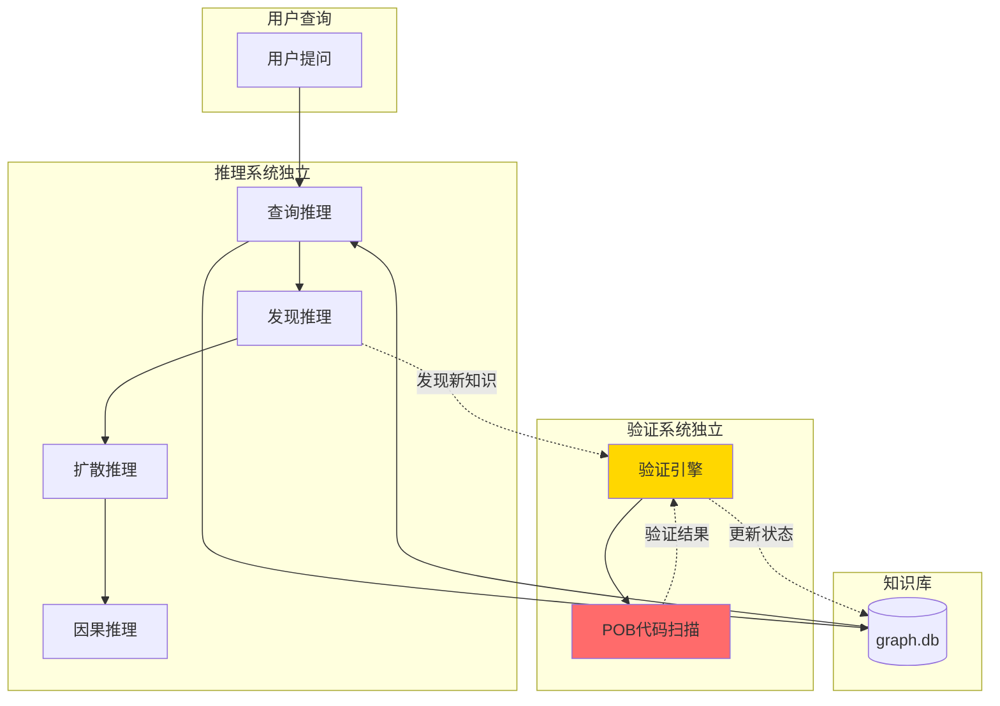
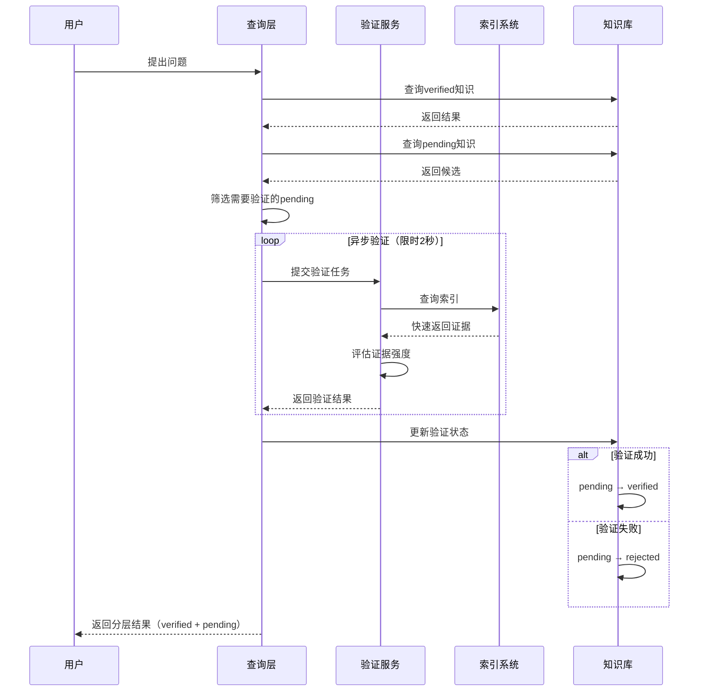
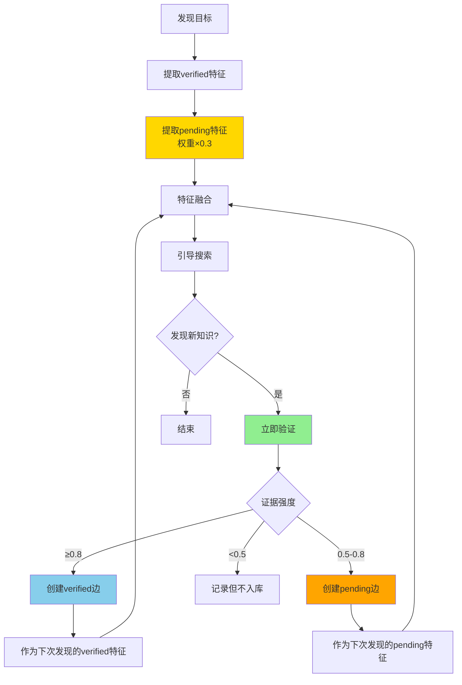
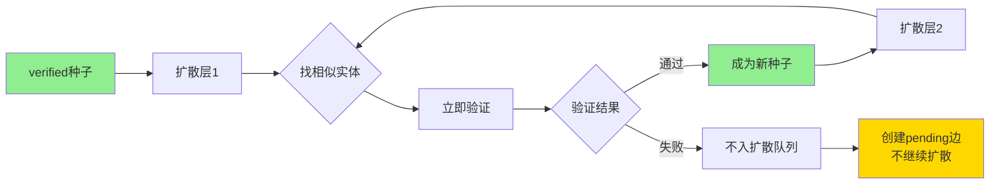
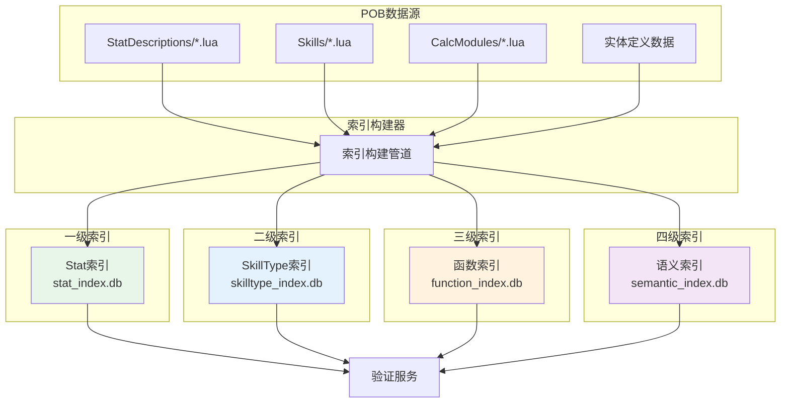
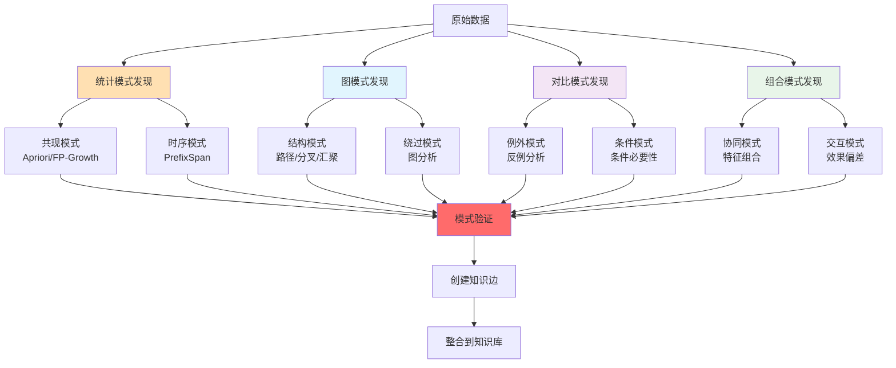
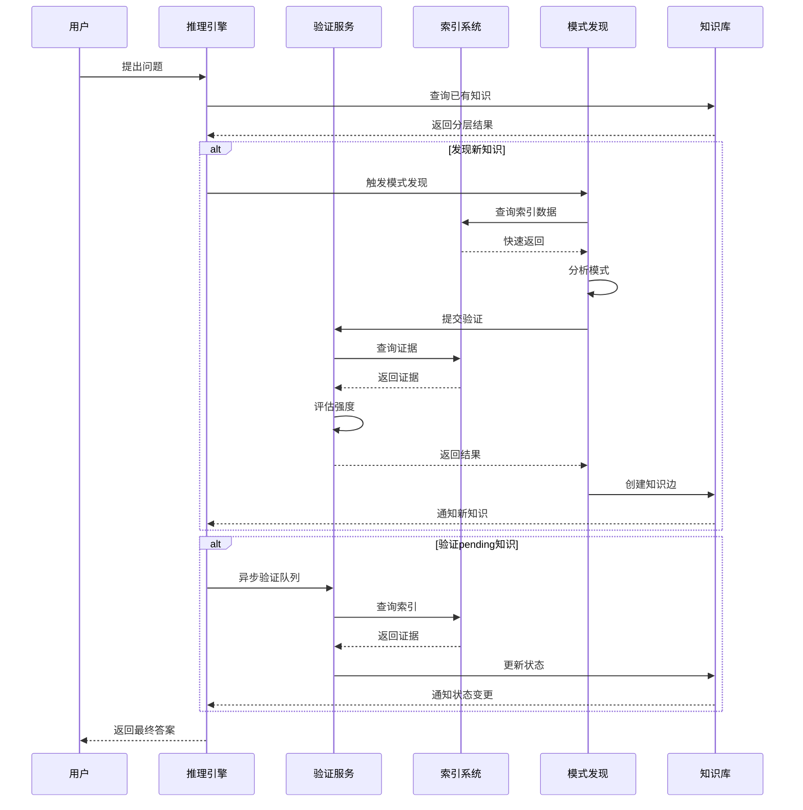
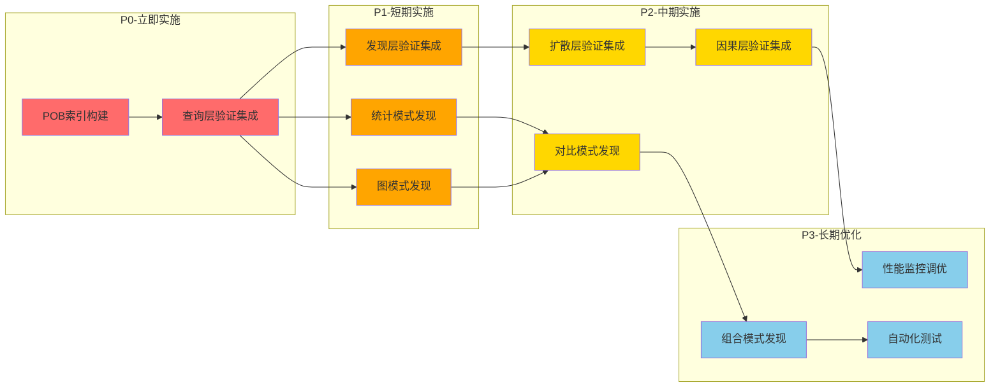

# 深度集成与优化 - 架构对比与流程总结

## 一、架构对比：优化前 vs 优化后

### 1.1 当前架构（分离式）



**问题**：
- ❌ 验证与推理分离，流程不连贯
- ❌ 每次验证都扫描文件，性能差
- ❌ pending知识无法发挥作用
- ❌ 模式发现依赖人工定义

### 1.2 优化后架构（深度集成）

```mermaid
graph TB
    subgraph 用户查询
        A[用户提问]
    end
    
    subgraph 启发式推理引擎（集成验证）
        B[验证感知查询层]
        C[验证引导发现层]
        D[验证约束扩散层]
        E[验证支持因果层]
    end
    
    subgraph 内嵌验证服务
        F[实时验证]
        G[异步验证队列]
    end
    
    subgraph 多级索引系统
        H[Stat索引]
        I[SkillType索引]
        J[函数索引]
        K[语义索引]
    end
    
    subgraph 知识库
        L[(graph.db)]
    end
    
    A --> B
    B --> F
    F --> H
    F --> I
    H --> F
    I --> F
    F --> B
    B --> L
    L --> B
    
    B --> C
    C --> G
    G --> H
    G --> I
    G --> J
    J --> G
    G --> C
    C --> L
    L --> C
    
    C --> D
    D --> F
    D --> L
    
    D --> E
    E --> F
    E --> L
    
    style B fill:#90EE90
    style C fill:#90EE90
    style D fill:#90EE90
    style E fill:#90EE90
    style H fill:#87CEEB
    style I fill:#87CEEB
    style J fill:#87CEEB
    style K fill:#87CEEB
```

**优势**：
- ✅ 验证内嵌推理，实时调整
- ✅ 多级索引，毫秒级查询
- ✅ pending知识引导发现
- ✅ 自动化模式发现

---

## 二、深度集成流程图

### 2.1 验证感知查询流程



### 2.2 验证引导发现流程



### 2.3 验证约束扩散流程



---

## 三、多级索引架构

### 3.1 四级索引结构



### 3.2 索引查询性能对比

| 查询类型 | 扫描文件 | Stat索引 | SkillType索引 | 函数索引 | 语义索引 |
|---------|---------|---------|--------------|---------|---------|
| Stat定义 | 2-5秒 | **<10ms** | - | - | - |
| SkillType约束 | 3-8秒 | - | **<20ms** | - | - |
| 函数调用 | 5-10秒 | - | - | **<50ms** | - |
| 相似实体 | 1-3秒 | - | - | - | **<100ms** |
| 综合查询 | 10-20秒 | **<200ms** | **<200ms** | **<200ms** | **<200ms** |

**性能提升**：平均 **150-250倍**

---

## 四、模式发现策略矩阵

### 4.1 四维度模式发现



### 4.2 模式发现示例

#### 统计模式发现

**共现模式**：
```
{spell, fire} → {fire_damage}
支持度: 0.85 (85%的实体同时出现)
置信度: 0.92 (92%的准确率)
提升度: 2.3 (比随机高2.3倍)
```

**时序模式**：
```
Trigger事件 → (延迟0.1s) → Energy消耗 → (延迟0.2s) → Skill释放
频率: 78% 的触发链遵循此模式
```

#### 图模式发现

**路径模式**：
```
Meta技能 --provides--> Triggered --causes--> CannotGenerateEnergy
实例: 5个Meta技能 (CoC, Mjolner等)
```

**绕过模式**：
```
Constraint: 能量限制
Bypass: generic_ongoing_trigger_does_not_use_energy
实例: TrailOfCaltropsPlayer, SpearfieldPlayer
```

#### 对比模式发现

**例外模式**：
```
规则: Triggered技能不能生成能量
例外: TrailOfCaltropsPlayer
原因: 特殊stat "generic_ongoing_trigger_does_not_use_energy"
```

**条件模式**：
```
规则: Melee技能有攻击速度加成
条件: 非法术Melee (排除 SpellMelee)
```

#### 组合模式发现

**协同模式**：
```
特征: Meta + GeneratesEnergy
效果: 能量循环机制
单独效果: Meta无能量生成, GeneratesEnergy无循环
```

**交互模式**：
```
组合: CoC + AwakenedSpellCascade
预期: 触发次数×1
实际: 触发次数×2
交互: 非线性叠加
```

---

## 五、完整验证流程（优化后）

### 5.1 端到端验证流程



### 5.2 性能优化对比

#### 优化前（分离式架构）

| 步骤 | 耗时 | 累计耗时 |
|------|------|---------|
| 查询知识 | 0.5秒 | 0.5秒 |
| 发现新模式 | - | - |
| 验证（扫描文件） | 5-10秒 | 5.5-10.5秒 |
| 更新知识库 | 0.2秒 | 5.7-10.7秒 |
| **总计** | **-** | **5.7-10.7秒** |

#### 优化后（深度集成架构）

| 步骤 | 耗时 | 累计耗时 |
|------|------|---------|
| 查询知识（含验证） | 0.3秒 | 0.3秒 |
| 发现新模式（索引支持） | 0.5秒 | 0.8秒 |
| 验证（索引查询） | 0.2秒 | 1.0秒 |
| 更新知识库 | 0.1秒 | 1.1秒 |
| **总计** | **-** | **1.1秒** |

**性能提升**：**5-10倍**

---

## 六、实施优先级与时间规划

### 6.1 实施优先级矩阵



### 6.2 时间规划

| 阶段 | 任务 | 预计时间 | 累计时间 |
|------|------|---------|---------|
| **Phase 0** | 索引系统基础 | 5天 | 5天 |
| | - Stat索引构建 | 2天 | |
| | - SkillType索引构建 | 2天 | |
| | - 索引管理器实现 | 1天 | |
| **Phase 1** | 查询层集成 | 3天 | 8天 |
| | - 验证感知查询 | 2天 | |
| | - 异步验证队列 | 1天 | |
| **Phase 2** | 发现层集成 | 5天 | 13天 |
| | - 验证引导发现 | 2天 | |
| | - 统计模式发现 | 2天 | |
| | - 图模式发现 | 1天 | |
| **Phase 3** | 扩散与因果集成 | 4天 | 17天 |
| | - 验证约束扩散 | 2天 | |
| | - 验证支持因果 | 2天 | |
| **Phase 4** | 高级模式发现 | 5天 | 22天 |
| | - 对比模式发现 | 2天 | |
| | - 组合模式发现 | 2天 | |
| | - 模式整合管道 | 1天 | |
| **Phase 5** | 性能优化 | 3天 | 25天 |
| | - 缓存优化 | 1天 | |
| | - 并发优化 | 1天 | |
| | - 性能监控 | 1天 | |
| **Phase 6** | 测试与文档 | 3天 | 28天 |
| | - 集成测试 | 2天 | |
| | - 文档编写 | 1天 | |

**总时间**：约4周

---

## 七、关键决策总结

### 7.1 架构决策

| 决策 | 选择 | 理由 |
|------|------|------|
| 验证位置 | 内嵌推理层 | 实时验证，动态调整 |
| 索引层级 | 四级索引 | 覆盖不同查询需求 |
| 验证方式 | 异步+同步混合 | 性能与响应平衡 |
| 模式发现 | 多策略并行 | 发现更多类型模式 |
| pending角色 | 引导线索 | 发挥价值而非阻断 |

### 7.2 性能决策

| 决策 | 目标 | 措施 |
|------|------|------|
| 单次验证 | <200ms | 索引查询+缓存 |
| 批量验证 | <2秒 | 异步队列+并发 |
| 模式发现 | <5秒 | 索引支持+增量更新 |
| 索引更新 | <1分钟 | 增量更新策略 |
| 相似度计算 | <100ms | 特征缓存 |

### 7.3 可扩展性决策

| 决策 | 方案 | 优势 |
|------|------|------|
| 索引分片 | 按文件类型分片 | 并行构建，独立更新 |
| 验证插件 | 策略模式 | 易扩展新验证方法 |
| 模式模板 | 模板方法模式 | 易添加新模式类型 |
| 配置外置 | YAML配置 | 动态调整，无需重启 |

---

## 八、风险与缓解

### 8.1 技术风险

| 风险 | 影响 | 概率 | 缓解措施 |
|------|------|------|----------|
| 索引过大 | 中 | 中 | 定期压缩、分片存储 |
| 验证耗时 | 高 | 低 | 超时控制、降级策略 |
| 模式噪音 | 中 | 高 | 置信度阈值、人工复核 |
| 集成复杂 | 高 | 中 | 分阶段实施、充分测试 |
| 性能退化 | 中 | 低 | 性能监控、定期优化 |

### 8.2 业务风险

| 风险 | 影响 | 概率 | 缓解措施 |
|------|------|------|----------|
| 验证误判 | 高 | 中 | 保守阈值、人工复核 |
| 知识库污染 | 高 | 低 | 状态隔离、事务保护 |
| 用户体验下降 | 中 | 低 | 流量控制、渐进式发布 |

---

## 九、成功指标

### 9.1 性能指标

| 指标 | 目标 | 测量方法 |
|------|------|----------|
| 验证响应时间 | <200ms | 性能监控日志 |
| 索引查询时间 | <50ms | 数据库慢查询日志 |
| 模式发现时间 | <5s | 发现流程日志 |
| 系统吞吐量 | >100次/分钟 | 系统监控 |

### 9.2 质量指标

| 指标 | 目标 | 测量方法 |
|------|------|----------|
| 自动验证准确率 | >95% | 人工抽样验证 |
| 模式发现有效数 | >100个/月 | 模式统计报告 |
| 知识库增长率 | >5%/月 | 知识库统计 |
| 用户满意度 | >4.5/5 | 用户反馈 |

### 9.3 业务指标

| 指标 | 目标 | 测量方法 |
|------|------|----------|
| 推理准确率 | +20% | A/B测试 |
| 用户干预减少 | -60% | 操作日志统计 |
| 发现效率提升 | 3x | 时间对比分析 |

---

## 十、总结

### 核心改进

1. **架构优化**：分离式 → 深度集成式
2. **性能提升**：扫描文件 → 多级索引，**150-250倍**提升
3. **功能增强**：人工模式发现 → 自动化多策略发现
4. **用户体验**：阻塞式验证 → 流畅式集成验证

### 实施路线

- **第1周**：索引系统基础 + 查询层集成
- **第2周**：发现层集成 + 模式发现基础
- **第3周**：扩散因果集成 + 高级模式发现
- **第4周**：性能优化 + 测试文档

### 预期效果

- 验证响应：**5-10秒 → 0.2秒**（25-50倍提升）
- 知识发现：**手工 → 自动**（效率提升无限）
- 系统流畅度：**阻塞 → 实时**（用户体验提升）
- 知识质量：**验证知识比例80%+**

---

**相关文档**：
- [完整设计方案](./OVERVIEW.md)
- [深度集成详细设计](./deep-integration-optimization.md)
- [核心设计原则](./design.md)
- [实施计划](./implementation.md)
